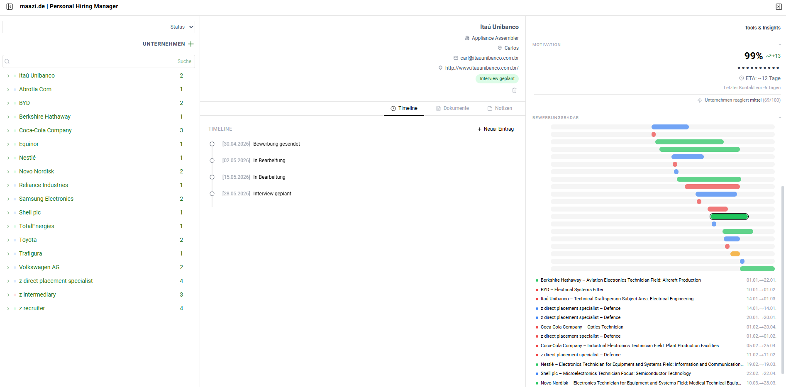
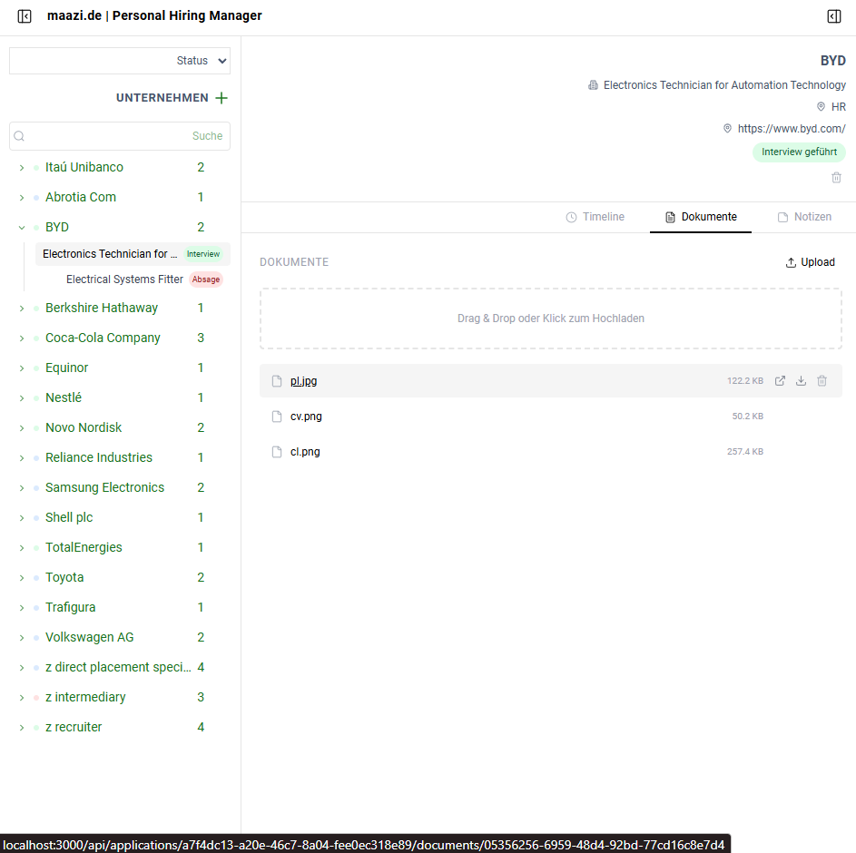
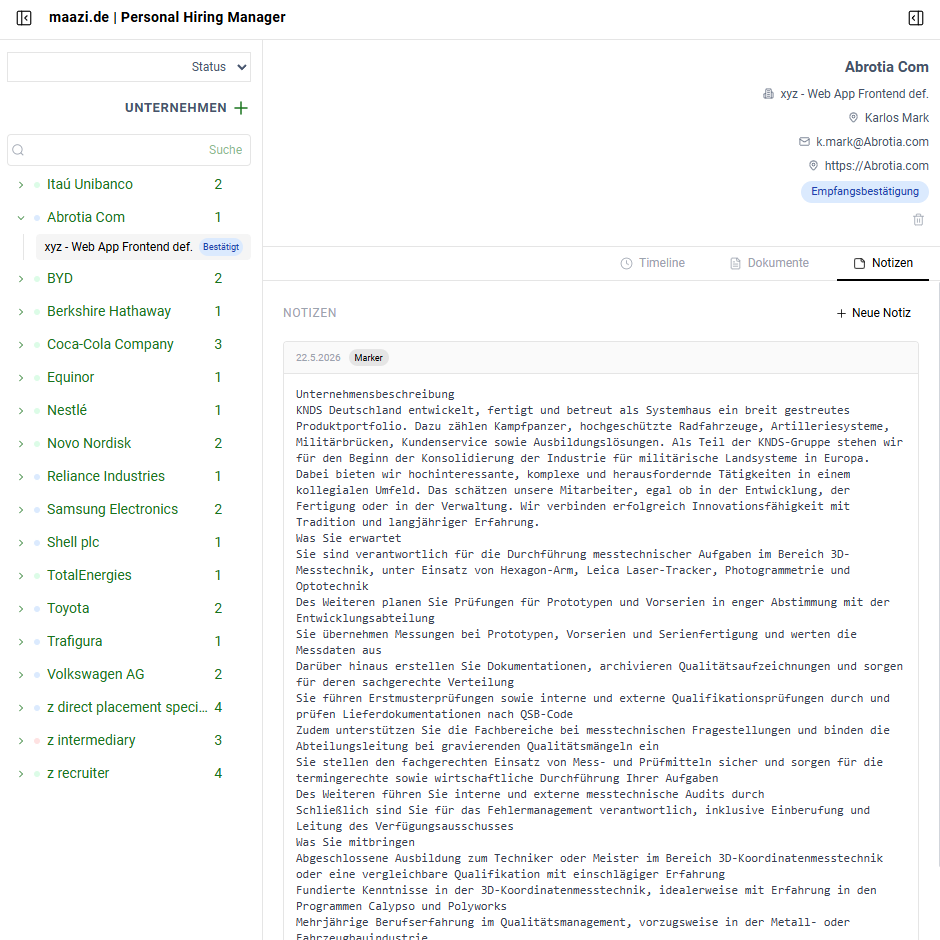

# 📋 maazi.de | Personal Hiring Manager

**Local. Datenschutz-first. Kostenlos.**

Eine Desktop-Anwendung zur Verfolgung von Bewerbungen, die strukturiert und durchsuchbar ist – vollständig lokal auf Ihrem Rechner.

[](https://nextjs.org/)
[](https://www.prisma.io/)
[](https://sqlite.org/)
[](https://tailwindcss.com/)
[](https://www.typescriptlang.org/)
[](./LICENSE)

---

## **Warum maazi.de | Personal Hiring Manager?**

Jobsuche bedeutet, Dutzende von Unternehmen, Kontakten, Dokumenten und Statusänderungen im Blick zu behalten. Tabellenkalkulationen werden schnell unübersichtlich, Cloud-Dienste werfen Datenschutzbedenken auf, und die meisten ATS-Tools sind für Recruiter – nicht für Sie.

**PHM** gibt Ihnen die Kontrolle:

- ✅ **100 % lokal** – Ihre Daten bleiben auf Ihrem Computer. Keine Konten, keine Cloud, keine Telemetrie.
- ✅ **Ein-Screen-Workflow** – 3‑Panel‑Layout (Unternehmen · Bewerbungsdetail · Erkenntnisse) – alles auf einen Blick.
- ✅ **Resizable & collapsible sidebars** – Ziehe die Kanten, um die Breite anzupassen, klicken Sie, um Seitenleisten einzublenden/ausblenden. Höhen der einzelnen Abschnitte im rechten Panel sind unabhängig einstellbar und werden in `localStorage` gespeichert.
- ✅ **Visuelle Timeline** – Sehe exakt, wo jede Bewerbung steht, mit farblich kodierten Statusen.
- ✅ **Dokumente: hochladen · öffnen · herunterladen · löschen** – Dateien in jede Bewerbung, leichter Überblick der Wichtigen Punkte (PDFs im Browser) oder lade mit einem Klick herunter.
- ✅ **Markdown‑Notizen** – Halte Anrufprotokolle, Vorbereitungsnotizen und Follow‑up‑Erinnerungen mit Tag‑Support.
- ✅ **Bewerbungsradar** – Ein Mini‑Gantt‑Diagramm zeigt alle aktiven Bewerbungen auf einen Blick.
- ✅ **JSON Exporte** – Strukturiertes JSON oder exportiere die Daten für Analysen.
- ✅ **Open Source (MIT)** – Verwende es, teile es, modifiziere es.

---

## 🖥️ Oberfläche


[](Personal-Hiring-Manager.mp4)

```
┌── Left Sidebar (resizable) ──┐ ┌── Application Detail ──────────┐ ┌── Right Tools (resizable) ───┐
│ 🔍 Search & Filter           │ │                  Siemens AG    │ │ 📊 Motivation Score         │
│                              │ │           🏢 Software Engineer │ │ ⌄ ───────────────────────── │
│ 🏢 Companies (grouped)       │ │           📍 Armon Torfom      │ │ 📡 Bewerbungsradar          │
│   ⌄ Siemens AG (3)           │ │           ✉  atorf@siemens.de │ │   coloured time bars         │
│     🔵 Software Engineer ⬤  │ │                ╭─ In Bearb. ─╮ │ │ ⌄ ────────────────────────── │
│     🟡 Systems Engineer  ⬤  │ │                ╰─────────────╯ │ │ 🔗 Quicklinks               │
│   ⌄ Rohde & Schwarz (1)      │ │                          🗑     │ │ ⌄ ────────────────────────── │
│     🟢 RF Technician     ⬤  │ │ Timeline │ Dokumente │ Notizen │ | 📤 Export JSON ·            │
│                              │ │                                │ │ ⌄ ────────────────────────── │
│ Right-click → Rename / Delete│ │ ● 05.05.2026  Bewerbung gesend.│ │                              │
│                              │ │ ● 07.05.2026  Empfangsbestät.  │ │                              │
│                              │ │ ● 12.05.2026  In Bearbeitung   │ │                              │
│                              │ │ ⬤ ??          Antwort erwartet│ │                              │
│                              │ │ ─────────────────────────────  │ │                              │
│                              │ │ 📎 Bewerbung.pdf    🔗 ⬇ 🗑    │ │                              │
│                              │ │ 📎 Lebenslauf.pdf   🔗 ⬇ 🗑    │ │                              │
│                              │ │ [Drag & Drop Upload/Downloas]  │ │                              │
└──────────────────────────────┘ └────────────────────────────────┘ └─────────────────────────────┘
        ↕ Drag right edge                                                  ↕ Drag left edge
        [▣] Toggle in header                                              [▣] Toggle in header
```

Die rechten Bereiche (Motivation · Radar · Schnellzugriffe · Export zur Analyse) sind einzeln **kollabierbar** (Pfeil‑Klick) und **höhenverstellbar** (Ziehen am unteren Rand, Doppelklick = Höhe zurücksetzen).




---

## Getting Started

### Voraussetzungen

- **Node.js** ≥ 18
- **npm** (kommt mit Node.js)

### 1. Klonen & Installieren

```bash
git clone https://github.com/ATOMICMBAG/personal-hiring-manager.git
cd personal-hiring-manager
npm install
```

### 2. Datenbank einrichten

```bash
npx prisma db push   # Erstellt SQLite‑Datenbank + Tabellen
npx prisma generate  # Generiert den Prisma‑Client
npm run db:seed      # (Optional) Füllt die DB mit Beispieldaten
```

### 3. App starten

```bash
npm run dev
```

Öffne [http://localhost:3000](http://localhost:3000) in Ihrem Browser.

> Die SQLite‑Datenbank liegt in `prisma/phm.db`. Sichere jede Datei – das ist der gesamte Anwendungsstatus.

---

## Tech Stack

| Layer     | Technologie                                                  |
| --------- | ------------------------------------------------------------ |
| Framework | [Next.js 15.5](https://nextjs.org/) (App Router)             |
| Sprache   | TypeScript                                                   |
| Datenbank | SQLite via [Prisma 6](https://www.prisma.io/)                |
| Zustand   | [Zustand 5](https://zustand.docs.pmnd.rs/)                   |
| Styling   | [Tailwind CSS 4](https://tailwindcss.com/)                   |
| Icons     | [Lucide React](https://lucide.dev/)                          |
| Markdown  | [react-markdown](https://remarkjs.github.io/react-markdown/) |

---

## Project Structure

```
src/
├── app/
│   ├── api/
│   │   ├── companies/              # GET, PATCH / DELETE company
│   │   └── applications/
│   │       ├── [id]/               # GET, PATCH, DELETE application
│   │       │   ├── timeline/       # POST new timeline event
│   │       │   │   └── [eventId]/  # DELETE single timeline event
│   │       │   ├── documents/      # POST upload
│   │       │   │   └── [docId]/    # GET (inline / ?download=1) + DELETE
│   │       │   └── notes/          # POST / DELETE notes
│   │       └── route.ts            # POST new application
│   ├── globals.css                 # Tailwind 4 entry + design tokens (@theme)
│   ├── layout.tsx
│   └── page.tsx
├── components/
│   ├── layout/
│   │   ├── main-layout.tsx         # 3-panel shell, resizable widths
│   │   ├── left-sidebar.tsx        # Company tree, search, filter
│   │   ├── right-sidebar.tsx       # Insights, radar, exports (CollapsibleSections)
│   │   ├── panel-resizer.tsx       # ↔︎ drag handle for sidebar width
│   │   └── collapsible-section.tsx # ⌄ header + ↕︎ drag handle per section
│   └── applications/
│       ├── application-detail.tsx  # Tabbed detail view (header right-aligned)
│       ├── application-timeline.tsx
│       ├── application-documents.tsx  # Upload + Open + Download + Delete
│       ├── application-notes.tsx
│       └── new-application-modal.tsx
└── lib/
    ├── prisma.ts                   # Prisma singleton
    ├── store.ts                    # Zustand global state (persisted UI prefs)
    └── status-colors.ts            # Colour mapping per status
prisma/
├── schema.prisma                   # Data model
├── seed.ts                         # Demo data (git nicht geplant)
├── phm.db                          # SQLite database (git-ignored / Deine Datenbank)
└── uploads/                        # Uploaded documents (git-ignored / Deine Dokumente)
```

---

## Entwicklungsbefehle

| Befehl              | Beschreibung                          |
| ------------------- | ------------------------------------- |
| `npm run dev`       | Startet den Entwicklungs‑Server       |
| `npm run build`     | Erstellt das Produktions‑Build        |
| `npm run db:push`   | Synchronisiert Prisma‑Schema → SQLite |
| `npm run db:seed`   | Füllt die Datenbank mit Demo‑Daten    |
| `npm run db:studio` | Öffnet Prisma‑Studio (GUI)            |
| `npm run lint`      | Führt ESLint aus                      |

---

## Exportiere JSON für weiter Verarbeitung oder z.B. direkt im Webbrowser-Edge Copilot‑Interaktion

**Exportiere als JSON** für weitere **lokale und sichere** Personelle Analyse. Die App ist zusätzlich für die Nutzung im **Webbrowser Edge mit Copilot** konzipiert. Nutze die Webbrowser lese funktion fon Copilot Edge!

- Klicke auf **„Exportiere JSON“**, um dieselben Daten als Datei herunterzuladen.
- Frage dein Edge Copilot im Webbrowser direkt an deiner Liste oder Unternehmens Akte. z.B.:

> _„Analysiere meine Bewerbungsaktivität der letzten 14 Tage.“_  
> _„Vergleiche meine Motivation über alle offenen Bewerbungen.“_  
> _„Schlage eine Antwort‑E‑Mail für den Status ‘Interview geplant’ vor.“_

Das exportierte JSON enthält Metadaten zur Bewerbung, die komplette Timeline und alle Notizen – alles, was die KI für Kontext benötigt.

---

## Datenschutz

- **Keine Analysen**, keine Verfolgung, keine Telemetrie.
- **Keine Netzwerkanfragen** außer den Quicklinks, die explizit angeklick werden muss wenn du aus der box willst.
- Die SQLite‑Datenbank (`prisma/phm.db`) und die hochgeladenen Dokumente (`prisma/uploads/`) bleiben auf Ihrem Rechner. Selber Sichern, migrieren oder löschen.

---

## Custom‑Styling‑Leitfaden (Tailwind 4)

Dieses Projekt verwendet **Tailwind CSS 4** – eine CSS‑first‑Konfiguration. Es gibt **keine** `tailwind.config.js`. Alle Anpassungen erfolgen in `src/app/globals.css` im `@theme inline { }`‑Block.

Neue Design‑Token hinzufügen

```css
@theme inline {
  --color-brand: #19741d; /* bg‑brand, text‑brand */
  --color-brand-light: #d9ffd9; /* bg‑brand‑light */
  --spacing-0_5: 0.125rem; /* p‑0_5, m‑0_5 */
}
```

Die UI folgt einem strengen **schwarz‑weiß‑Farbschema** mit dezenten Grautönen – inspiriert von Desktop‑Produktivitäts‑Tools. Status‑Badges verwenden ein zurückhaltendes Traffic‑Light‑Palette (Bernstein, Blau, Grün, Rot), um Informationen zu vermitteln, ohne abzulenken.

| Element     | Farbe     |
| ----------- | --------- |
| Hintergrund | `#FFFFFF` |
| Text        | `#000000` |
| Ränder      | `#E5E5E5` |
| Hover       | `#F5F5F5` |
| Grauer Text | `#6B7280` |

### Beliebig‑Werte (immer verfügbar)

Tailwind 4 unterstützt Bracketsyntax out‑of‑the‑box – keine Konfiguration nötig:

```css
p-[12px]    /* Abstand */
text-[14px] /* Schriftgröße */
rounded-[3px] /* Rundungsradius */
```

---

## Contributing & Lizenz

Pull‑Requests sind willkommen!

MIT © 2026

Viel Erfolg bei der Jobsuche!
